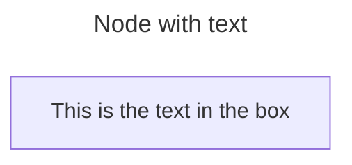

# Create ZFS pool with 2-way mirror vdevs

## Relations

Follows up [241106 - Use ZFS to manage media storage](/media-server/docs/decisions/241106-use-zfs-to-manage-media-storage.md)

## Goal

Select a device configuration the media storage ZFS pool.

## Options

1. 2-way mirror vdevs
2. 3-way mirror vdevs
3. raidz1 vdevs
4. raidz2 vdevs
5. raidz3 vdevs

## Decision

Use 2-way mirror vdevs to create a ZFS pool for media storage.

## Effects

Faster reads than RAID-Z because reading blocks can be parallelized across disks.
I can buy disks that prioritize reliability over speed because of this speed boost.

Similar write speed as RAID-Z for small files, slower for large files.

Less intense resilvers than RAID-Z.

I don't have to worry about the complexities of RAID-Z.

Expanding drive size in a mirror vdev or adding a mirror vdev to the pool only requires buying two new disks at a time.
RAID-Z would require buying larger batches of disks.

Lower CPU burden than RAID-Z because the CPU doesn't have to calculate parity bits.

50% storage efficiency.

I should buy drives that have similar performance characteristics to avoid throttling a high-performance disk,
and similar storage capacities to avoid wasting extra space in the larger drives.

## Assessment

I want storage redundancy because ZFS needs it to be able fix data errors.
This means one redundant copy of data.

I secondarily want redundancy for the convenience of not having to restore from backup whenever a drive fails.
This means at least one redundant copy of data, possibly more to reliably not have to restore from backup.

I'd like flexibility around expansion and change because I'm still learning
and I want to avoid foot-guns.

I also want flexibility to be able to add capacity slowly as needed.
Since I only have a few TB of data and it grows slowly,
and because storage getting cheaper as time passes,
it will be cheaper to buy drives as I need them.

I want recovering from a drive failure to be easy, fast, and low-stress.
I won't be in the mood to spend a lot of time troubleshooting when a drive fails,
and I want to be confident the recovery process works.

Since my time and brainpower is limited, I greatly value simplicity.

I want high storage efficiency.
Why would I spend more money on drives if I have the option to spend less?

I will also take good performance where it's offered.
Since this is primarily a media storage server,
the workload will be read-heavy.

To summarize, I am looking for:

- Storage redundancy
- Flexibility around maintenance: changing device count and capacity
- Reliable and fast recovery after device failure
- Simplicity
- Space efficiency
- Good read performance

No storage system can satisfy all of these desires.
I have listed them in priority order.

### ZFS pools and vdevs

A ZFS storage pool is a high-level abstraction over physical devices that
allows them all to be treated as one monolithic pool of storage.

A ZFS storage pool is created out of one or more virtual devices (vdevs).
A vdev is also an abstraction over physical devices, at a lower level than a pool,
that allows several devices to be treated as a single device with properties
depending on the type of vdev.

Many of ZFS' features are provided at the vdev level,
such as data redundancy and error correction.

ZFS currently provides four types of vdev for storage:
file, single-device, mirror, [RAID-Z](raidz_docs), and [dRAID](draid_docs).

[raidz_docs]: https://openzfs.github.io/openzfs-docs/Basic%20Concepts/RAID-Z.html
[draid_docs]: https://openzfs.github.io/openzfs-docs/Basic%20Concepts/dRAID%20Howto.html

ZFS also provides a few utility types: spare, cache, log, and special.
They don't seem relevant for this assessment.

File vdevs use a file from an existing file system as a vdev.
They are primarily intended for testing and experimentation, and not real use.[^8]

Single-device vdevs store data on a single device (who'd have thought).
Since single-device vdevs provide no redundancy, ZFS is not able to correct data errors.
When the device fails the vdev is lost.

A mirror vdev stores a redundant copy of data on each device in the vdev.
For example, a 3-way mirror vdev consists of three devices each with one copy of the data.

A RAID-Z vdev stripes data across the devices within the vdev,
along with parity bits to provide redundancy.
RAID-Z can use single, double, or triple parity,
referred to as raidz1, raidz2, and raidz3, respectively.

dRAID is an evolution of RAID-Z meant for very large arrays of devices, beyond what I'll ever use at home.

Out of all of these, mirrors and RAID-Z fit my use-case.

### Redundancy

Redundancy is how many devices can fail before data is lost.

ZFS only provides redundancy at the vdev level:
data in a pool is dynamically distributed across the vdevs,
and if a single vdev fails then all data in the pool is lost.
The robustness of the pool is limited by the weakest vdev,
and a rule of thumb is to create pools using only vdevs with the same redundancy.

A mirror vdev with $`d` devices has a redundancy of $`d - 1`$.
E.g. a 3-way mirror has a redundancy of two.

A RAID-Z vdev with $`d` devices and $`p` parity has a redundancy of $`p`$.
E.g. raidz2 has a redundancy of 2 regardless of the number of disks in the vdev.

### Storage efficiency

Storage efficiency is how much of the total drive capacity can actually be used to store data.

ZFS treats all devices in a vdev as having the same capacity as the smallest device in that vdev.
Using devices of unequal size will waste the extra space on the larger devices,
so a rule of thumb is match the capacity of all devices within a vdev.

A mirror vdev with $`d` devices has a storage efficiency of $`1 / d`$.
E.g. efficiency of a 2-way mirror is 50%, and a 3-way mirror is 33%.
While mirror vdevs can theoretically have any number of devices,
the storage efficiency quickly lowers beyond normal usefulness.

A RAID-Z vdev with $`d` devices and $`p` parity has a storage efficiency of $`d - p / d`$.
Increasing the number of devices in the vdev (referred to as _width_) increases efficiency,
while increasing parity lowers efficiency.
E.g. efficiency of a 3-wide raidz1 is 66%, a 4-wide raidz2 is 50%, and an 11-wide raidz3 is 72%.

RAID-Z almost always provides better storage efficiency than mirrors.

### Flexibility

ZFS imposes some constrains on how vdevs can be changed once created.
It is good to think ahead a bit to make sure the vdev doesn't get locked into an undesired configuration.

Mirror vdevs can have devices added or removed after creation.

Mirror vdev storage capacity can be increased by replacing all devices in the vdev with larger devices.
This means replacing 2-3 drives at a time.

Storage can be increased by adding a new mirror vdev, requiring 2-3 new drives.

Having a RAID-Z vdev in a pool prevents any vdev from being removed from the pool.[^1]

RAID-Z vdevs can have new devices added[^2], but not removed.
Adding a device will not re-flow existing data, so existing data will still have the original storage efficiency.
With enough file churn, ZFS will eventually balance out the data since
re-flow happens naturally over time due to copy-on-write.
My workload is archival so this won't happen, though.
In practice this is not a big deal: RAID-Z doesn't guarantee the full storage efficiency for every block anyways,[^4]

To increase capacity a whole new RAID-Z vdev should be added,
or a lot of disks need to be upgraded.
Upgrading disks also involves a lot of lengthy resilvers,
and may not be feasible for large RAID-Z vdevs.

The parity level of a RAID-Z vdev cannot be changed after creation.

### Performance

ZFS distributes operations across vdevs,
and the performance of a pool trends towards the average performances of its vdevs.
Creating a pool from vdevs with the same performance characteristics makes
the performance of the pool more predictable and reliable.
A rule of thumb is to pick one vdev type for the pool, and use the same types of devices in each vdev.[^6]

Performance is a deep topic and highly depends on workload.
To get a sense of the space, I will look at maximum IOPS and throughput for read and write operations.

I will look at extremes streaming read, concurrent read, streaming write, and concurrent write to get a feel for the space,
and try to interpolate.

Mirror write speed is limited by the slowest devices in the vdev,
since the data needs to be written to every device.

Mirror single reads perform at average speed of the disks in the vdev, since data will be read off one of the devices at random.
Mirrors can improve concurrent read performance by spreading reads across multiple devices.

RAID-Z write performance
RAID-Z incurs some CPU load in order to calculate the parity bits.
I'm not sure how much in practice.

ZFS requires thinking about performances at two levels: performance of a pool and performance of a vdev.

Pool IOPS is a function of the number of vdevs, because both mirrors and RAID-Z perform like the average device in the vdev.
2-way mirror pools

### Failure performance

When a vdev with redundancy has a device fail, it enters a degraded state.
Different vdev types exhibit different behaviors when degraded.

A vdev will continue to function in a degraded mode after a device failure if it has enough redundancy.
The performance of the vdev after a device failure varies depending on the type.

Since my server is not mission-critical, I don't mind poor performance when a vdev is degraded.

Mirror vdev devices failure don't affect performance much,
with the exception being concurrent read performance since reads cannot be distributed across as many devices.

When a device fails, RAID-Z performance is severly degraded because all devices must be read in order
to do the parity calculations necessary to cover for the failed device.
What happens when writing to a degraded RAIDz array?

### Failure recovery

A vdev with redundancy can have the failed device replaced and the new device integrated in.
a process called a resilver.
The resilver operation is actually the same as a scrub, so the duration will be similar.

My scrubs currently take 3.5 hours, as shown by `zpool status`.

The longer a resilver, and the more disks involved, the more likely a second failure.

When resilvering a mirror, ZFS copies data from the healthy devices over to the new devices.

Recovering from a RAID-Z device failure involves reading from all remaining devices to recreate the missing data.
This places a lot of load on the remaining disks,
and anecdotally the odds of a second failure during a RAID-Z resilver are uncomfortably high.[^7]
The general wisdom of the internet recommends skipping raidz1 in favor of raidz2, or even raidz3.

RAID-Z width is mainly limited by
How to choose RAID-Z width?[^4]
The wider the array and the larger the disks,
the longer and more intense a resilver will be.
Choosing certain sizes can avoid storage overhead.[^6]
Rule of thumb that RAID-Z vdev device counts should be kept to single digits or low teens.

### Simplicity

Mirror vdevs are pretty simple: slap two devices together and it's good to go.
To expand capacity, add another mirror vdev to the pool or
replace both devices with a larger one.
In either case, only two devices are involved at a time.

RAID-Z vdevs present more choices: how wide, and raidz2 or raidz3?
To increase capacity a whole new RAID-Z vdev should be added,
or a lot of disks need to be upgraded.
Upgrading disks also involves a lot of lengthy resilvers,
and may not be feasible for large RAID-Z vdevs.

RAID-Z presents more axis of choice, and striping + parity is more complicated than simple copies.
RAID-Z data disks could be powers of 2, e.g. 10 disk raidz2 for 8 data disks.

## References

[^1]: https://serverfault.com/questions/1142074/why-doesnt-zfs-vdev-removal-work-when-any-raidz-devices-are-in-the-pool
[^2]: https://openzfs.github.io/openzfs-docs/man/master/8/zpool-attach.8.html
[^3]: https://en.wikipedia.org/wiki/Parity_bit
[^4]: https://www.delphix.com/blog/zfs-raidz-stripe-width-or-how-i-learned-stop-worrying-and-love-raidz
[^5]: http://nex7.blogspot.com/2013/03/readme1st.html
[^6]: https://jro.io/truenas/openzfs/
[^7]: https://jro.io/r2c2/
[^8]: https://docs.oracle.com/cd/E19253-01/819-5461/gazcr/index.html

[Wikipedia: Standard RAID Levels](https://en.wikipedia.org/wiki/Standard_RAID_levels)
[NAS RAID Levels Explained: Choosing The Right Level To Protect Your NAS Data](https://www.backblaze.com/blog/nas-raid-levels-explained-choosing-the-right-level-to-protect-your-nas-data/)
https://www.reddit.com/r/zfs/comments/3gpkm9/statistics_on_realworld_unrecoverable_read_error/
https://www.truenas.com/community/resources/assessing-the-potential-for-data-loss.227/
https://www.zdnet.com/article/why-raid-5-stops-working-in-2009/
https://queue.acm.org/detail.cfm?id=1670144

https://static.ixsystems.co/uploads/2020/09/ZFS_Storage_Pool_Layout_White_Paper_2020_WEB.pdf
https://arstechnica.com/information-technology/2020/05/zfs-101-understanding-zfs-storage-and-performance/
[A Closer Look at ZFS, Vdevs and Performance](https://constantin.glez.de/2010/06/04/a-closer-look-zfs-vdevs-and-performance/)
[ZFS: You should use mirror vdevs, not RAID-Z.](https://jrs-s.net/2015/02/06/zfs-you-should-use-mirror-vdevs-not-raidz/)
[ZFS Raidz Performance, Capacity and Integrity](https://calomel.org/zfs_raid_speed_capacity.html)

https://arstechnica.com/gadgets/2020/05/zfs-versus-raid-eight-ironwolf-disks-two-filesystems-one-winner/
https://arstechnica.com/gadgets/2020/02/how-fast-are-your-disks-find-out-the-open-source-way-with-fio/

https://blocksandfiles.com/2022/06/20/resilvering/
